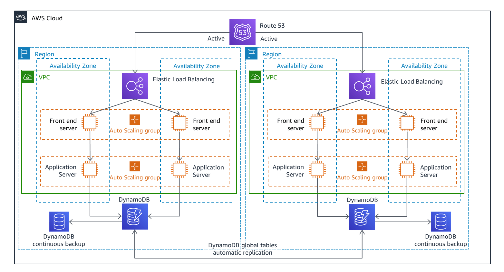
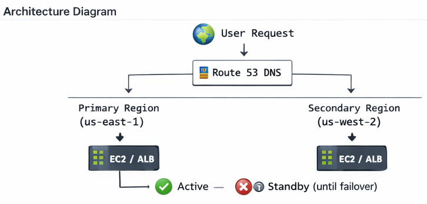
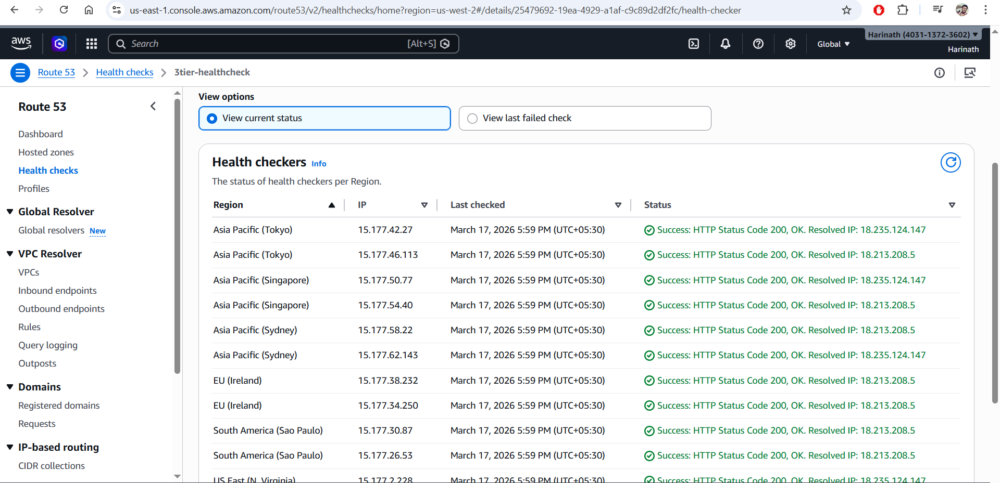
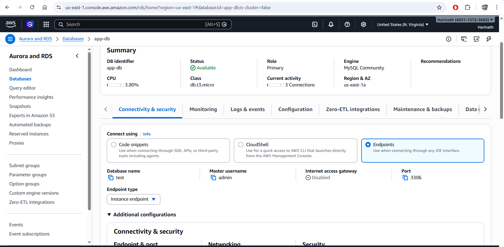
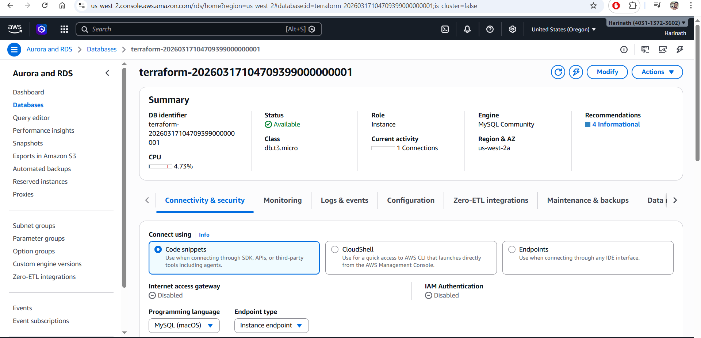
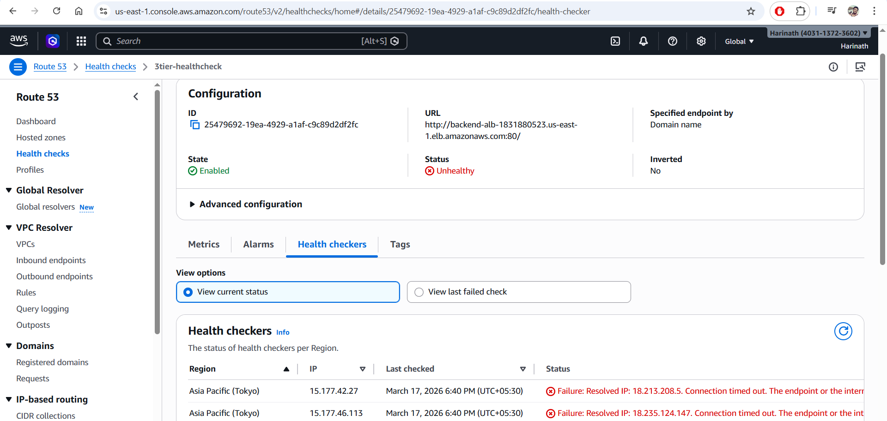
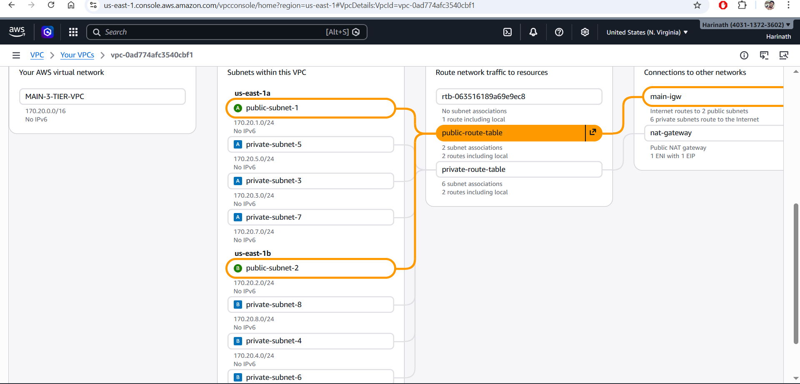
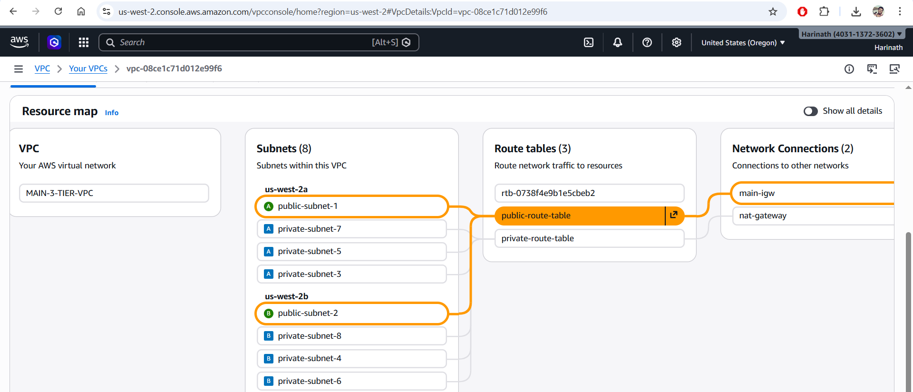
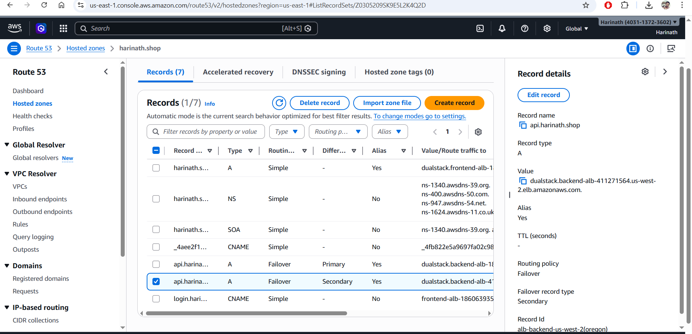

## 🌐 Multi-Region Failover Architecture using AWS Route 53

This project implements a **highly available and fault-tolerant architecture** by routing traffic between AWS regions using **Route 53 DNS failover**.

### 📌 Architecture Overview

- **Primary Region:** North Virginia (`us-east-1`)
- **Secondary (Failover) Region:** Oregon (`us-west-2`)
- **Traffic Management:** AWS Route 53 (DNS-level failover routing)
- 
## Architecture Diagram

## 🌐 Traffic Flow

User → Route53 → Primary → Failover → Secondary

## 🔁 Failover Demonstration (Step-by-Step)

This section shows how traffic flows and how AWS handles failover using real screenshots.

---

### 🟢 Step 1: Before Failure (Primary Region Active - us-east-1)

- Application is served from **North Virginia**
- Load Balancer routes traffic to healthy instances
- Database is primary in this region

---

### ❤️ Step 2: Route 53 Health Check

- Route 53 continuously monitors the primary region
- Health check ensures application availability
- Status: Healthy ✅  
- Route 53 confirms primary region is reachable
- Traffic continues to us-east-1  

---
### 🗄️ Step 3: RDS Cross-Region Replication

- Data replicated from us-east-1 → us-west-2  
- RDS Read Replica created in DR region  
- **Asynchronous replication ensures near real-time data sync**

---

### 🔴 Step 4: During Failure (Health Check FAILED - Primary Region Down)

- Status: Unhealthy ❌  
- Primary region not responding  
- Primary region becomes unhealthy
- Route 53 detects failure via health checks
  

---

### 🔄 Step 5: After Failover (Secondary Region Active - us-west-2)

- Traffic is redirected to **Oregon region**
- Load Balancer serves requests from DR region
- RDS Read Replica is promoted to primary

---

## 🌐 Network Architecture (Multi-Region VPC)

This section shows the underlying VPC design across both regions.

---

### 🏢 Primary Region VPC (us-east-1 - North Virginia)

- Multi-AZ VPC architecture  
- Public subnets for Load Balancer  
- Private subnets for application and database layers  

---

### 🌎 Secondary Region VPC (us-west-2 - Oregon)

- Identical VPC setup for disaster recovery  
- Ensures seamless failover and consistency  

---

## 🔁 Route 53 Backend Failover Flow

- Route 53 routes traffic to backend load balancer  
- Under normal conditions → Primary region serves traffic  
- During failure → Traffic automatically redirected to DR region  

## 🛠️ Infrastructure as Code (Terraform)

- Entire infrastructure is provisioned using Terraform  
- Modular design for multi-region deployment  
- Enables consistent and repeatable deployments
 
## 🚀 Summary of Failover

- DNS-level failover ensures zero manual intervention during outages
- Route 53 automatically redirects traffic  
- No manual intervention required  
- Data remains consistent via RDS replication  
- High availability achieved using multi-region setup  

### ⚙️ How It Works

- Route 53 is configured with **Failover Routing Policy**.
- Under normal conditions:
  - All user traffic is routed to the **primary region (North Virginia)**.
- If the primary region becomes unavailable:
  - Route 53 automatically redirects traffic to the **secondary region (Oregon)**.
- Health checks are used to monitor the availability of the primary endpoint.

### 🧱 Components Used

- AWS Route 53 (Failover Routing + Health Checks)
- EC2 instances (in both regions)
- Application deployed identically in both regions
- Optional: Load Balancer (ALB) for better scalability

### 🔁 Failover Flow

1. User sends request to application domain.
2. Route 53 resolves DNS to **primary region (us-east-1)**.
3. If health check fails:
   - Route 53 switches DNS to **secondary region (us-west-2)**.
4. Traffic continues without manual intervention.

### 🚀 Benefits

- High Availability
- Automatic Disaster Recovery
- Zero manual failover
- Improved reliability for production workloads

### 📁 Notes

- Both regions are configured with identical infrastructure to ensure consistent failover behavior  
- Route 53 health check thresholds are tuned to avoid false failover triggers  
- RDS cross-region replication is asynchronous, which may introduce minimal replication lag  
- Regular testing of failover scenarios is recommended to validate disaster recovery readiness  
