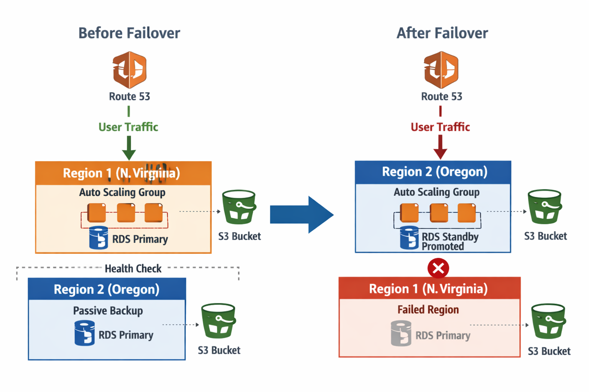

## 🌐 Multi-Region Failover Architecture using AWS Route 53

This project implements a **highly available and fault-tolerant architecture** by routing traffic between AWS regions using **Route 53 DNS failover**.

### 📌 Architecture Overview

- **Primary Region:** North Virginia (`us-east-1`)
- **Secondary (Failover) Region:** Oregon (`us-west-2`)
- **Traffic Management:** AWS Route 53 (DNS-level failover routing)
- 
## Architecture Diagram

### ⚙️ How It Works

- Route 53 is configured with **Failover Routing Policy**.
- Under normal conditions:
  - All user traffic is routed to the **primary region (North Virginia)**.
- If the primary region becomes unavailable:
  - Route 53 automatically redirects traffic to the **secondary region (Oregon)**.
- Health checks are used to monitor the availability of the primary endpoint.

### 🧱 Components Used

- AWS Route 53 (Failover Routing + Health Checks)
- EC2 instances (in both regions)
- Application deployed identically in both regions
- Optional: Load Balancer (ALB) for better scalability

### 🔁 Failover Flow

1. User sends request to application domain.
2. Route 53 resolves DNS to **primary region (us-east-1)**.
3. If health check fails:
   - Route 53 switches DNS to **secondary region (us-west-2)**.
4. Traffic continues without manual intervention.

### 🚀 Benefits

- High Availability
- Automatic Disaster Recovery
- Zero manual failover
- Improved reliability for production workloads

### 📷 Architecture Diagram (Optional)

> Add your architecture diagram here for better visualization.

### 📁 Notes

- Ensure both regions have identical infrastructure and deployments.
- Health check thresholds should be configured carefully to avoid false failovers.
